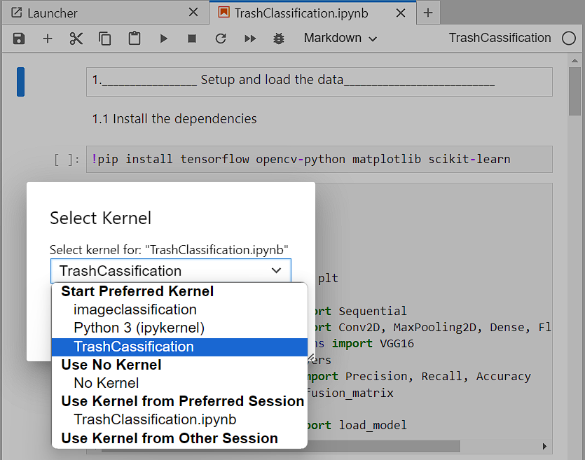
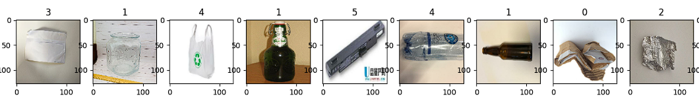
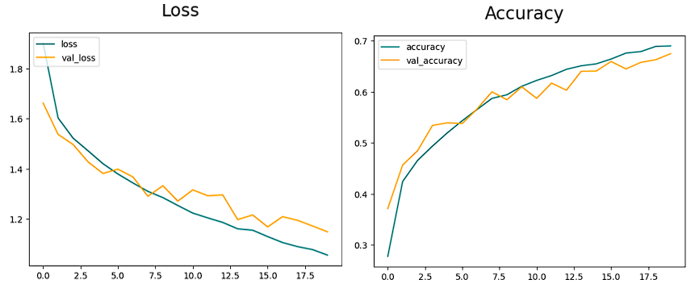

# Trash-clasifier-using-CNN--DeepLeraning--

Code developed for "S. Sanchez, - "Trash Classification using CNN".
Master's graduate "Calabria University".
For any questions or suggestions write to sofysan.1993@gmail.com
# Sumary.
This repository contains a machine learning project showcasing the application of convolutional neural networks for the accurate classification of six distinct trash categories: "Paper, Cardboard, Glass, Metal, Plastic, and Common trash." The model achieves impressive performance metrics, with precision at 97%, recall at 95%, and an overall accuracy of 81%. The project was meticulously developed in Jupyter using Python, with Tensorflow and Keras serving as the primary libraries.  
The Dataset was obtained from the following dataset repositories  
https://www.kaggle.com/datasets/sumn2u/garbage-classification-v2  
https://github.com/garythung/trashnet

# Get started from scratch to use this ML model
### 1. Install Python and Jupyter with Anaconda  
https://www.anaconda.com/download  
Please, make sure that you check Add Anaconda3 to the system PATH when you install the program.  
To check, open the command prompt and run: jupyter notebook.  
### 2. Environment creation workflow and Git install
https://git-scm.com/download/win  
- Install the 64-bit Git for Windows
- Once installed clone this repository using the  command prompt and the code: git clone https://github.com/fercho-0109/TrashClassification/tree/main   
**Environment creation** 
- Open the command prompt and go to the directory TrashClassification: cd TrashClassification
- Create the environment using: python -m venv TrashCassification
- Activate the environment using: .\TrashCassification\Scripts\activate
- Install ipykernel using: pip install ipykernel
- then use: python -m ipykernel --name=TrashCassification
- Now associate the environment with a jupyter notebook. So open jupyter using: jupyter notebook, and select TrashCassification directory. Then associate the environment as show in the image

  

### 3. How to install Tensorflow for Deep Learning 
!pip install tensorflow opencv-python matplotlib scikit-learn. **this line is already included in the code** 

## Classes 

  

 

0. cardboard 
1. glass
2. metal,
3. paper,
4. plastic
5. trash  
# Simulations 
Here we can see how the Loss and Acurrancy evolving over the training  

  

 
Here we can see the confusion matrix.  

  

 
